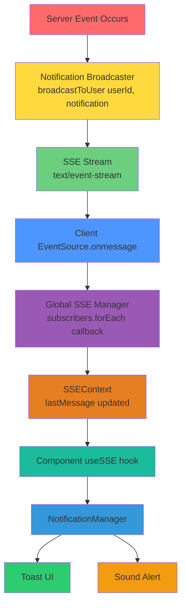
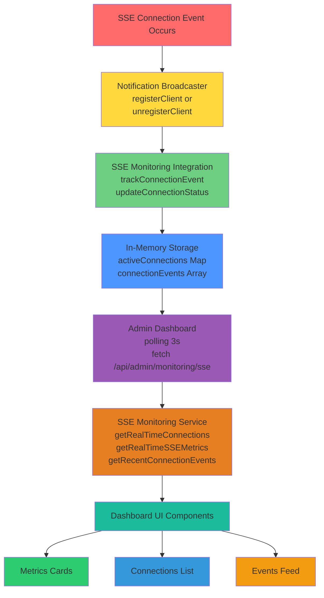
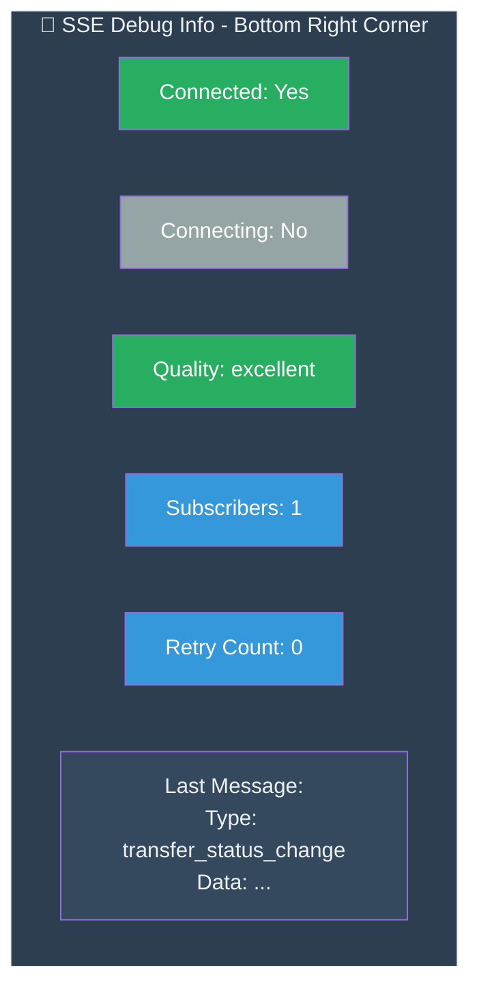
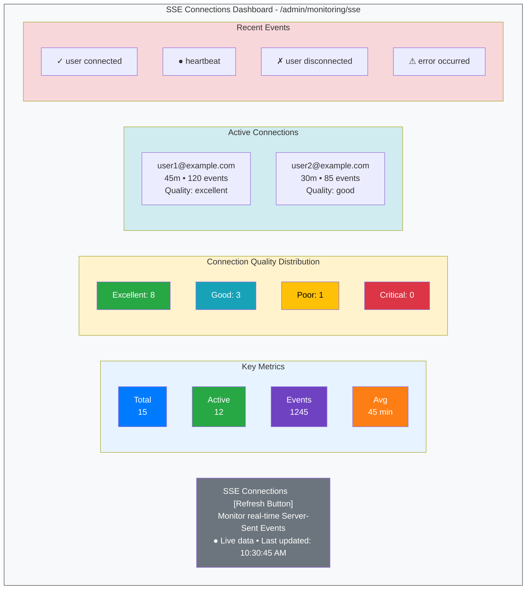
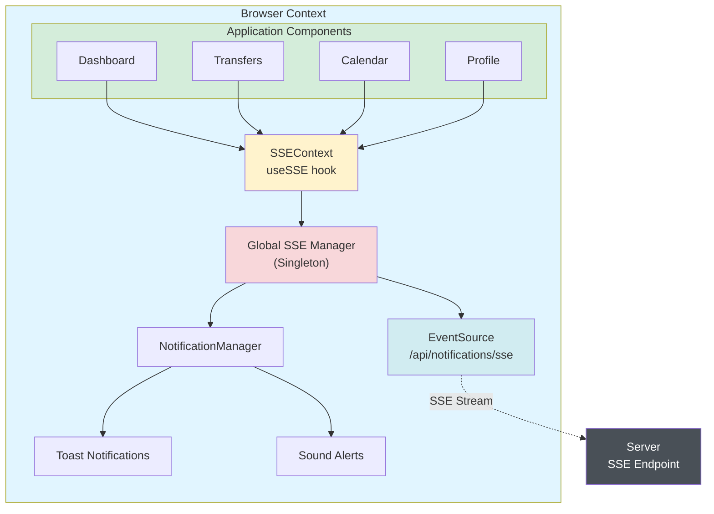
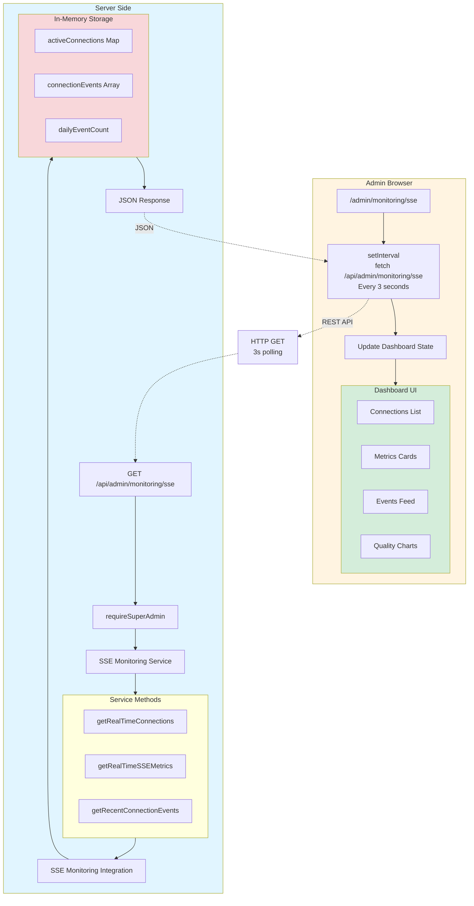
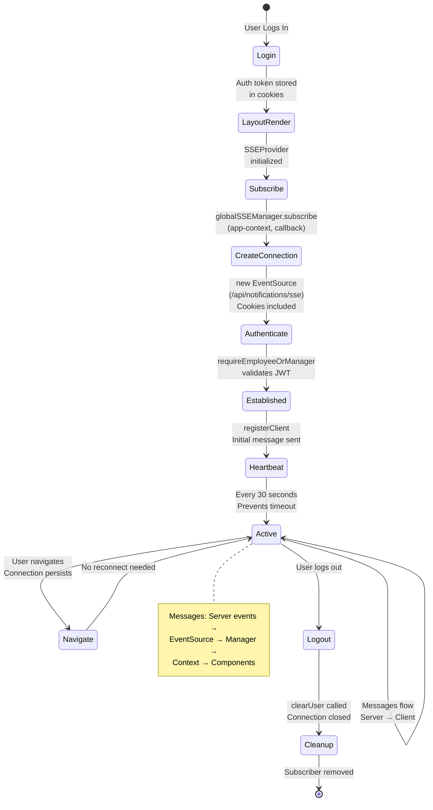
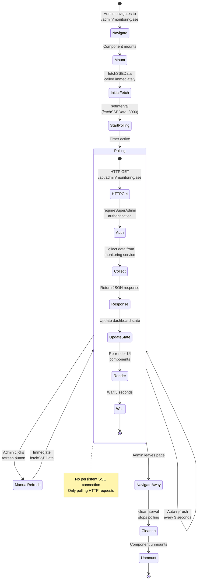
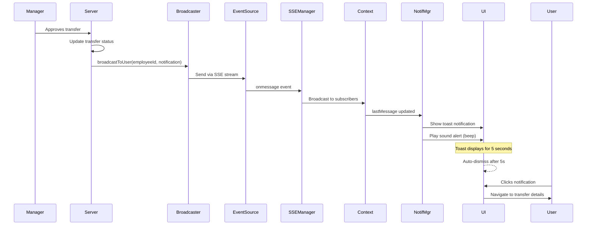
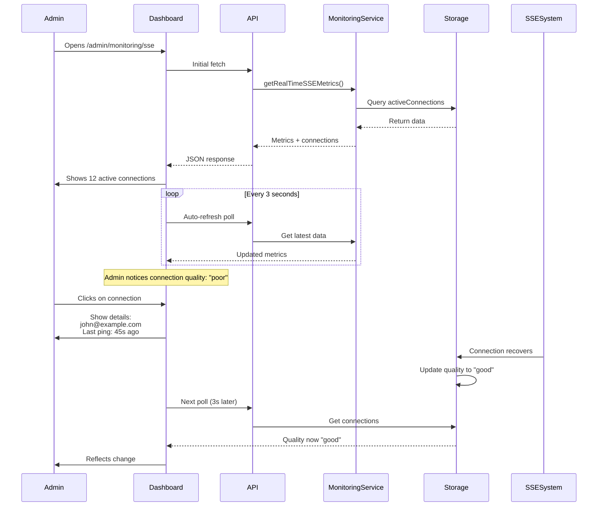

# SSE System - User vs Admin Comparison

## Side-by-Side Comparison

| Feature | Normal User Side | Admin Side |
|---------|-----------------|------------|
| **Primary Purpose** | Receive real-time notifications | Monitor all SSE connections |
| **Connection Type** | Single EventSource connection | API polling (3s interval) |
| **Main Interface** | Toast notifications + Debug panel | Monitoring dashboard |
| **Access Control** | employee, manager, admin, super_admin | super_admin only |
| **Data Visibility** | Own notifications only | All connections and events |
| **UI Components** | NotificationManager, SSEDebugger | Full admin dashboard with metrics |
| **Connection Management** | Automatic (via Global SSE Manager) | Read-only monitoring |
| **Real-time Updates** | Via SSE stream | Via API polling |
| **Message Types** | transfer_status_change, new_transfer, urgent_transfer, reminder | Connection events, metrics, user activity |
| **Notification Actions** | View, dismiss, mark as read | View, analyze, track |
| **Debug Tools** | Bottom-right debug panel | Full monitoring dashboard |
| **Sound Alerts** | ✅ Web Audio API beeps | ❌ No sounds |
| **Connection Quality** | Shown in debug panel | Calculated and displayed for all users |
| **Auto-reconnect** | ✅ Exponential backoff (max 5 attempts) | N/A (not a persistent connection) |
| **Heartbeat** | Receives every 30s | Tracks all heartbeats |
| **Event History** | Last message only | Last 1000 events stored |
| **Metrics** | Personal connection status | System-wide statistics |
| **Location** | All authenticated pages | /admin/monitoring/sse |

---

## Data Flow Comparison

### Normal User - Message Reception Flow



### Admin - Monitoring Data Flow



---

## User Interface Comparison

### Normal User - Debug Panel (Bottom Right)



### Admin - Full Dashboard



---

## Technical Architecture Comparison

### Normal User Side - Client Architecture



### Admin Side - Monitoring Architecture



---

## Connection Lifecycle Comparison

### Normal User - Connection Lifecycle



### Admin - Monitoring Session



---

## Key Differences Summary

| Aspect | Normal User | Admin |
|--------|-------------|-------|
| **Connection Type** | Persistent SSE (EventSource) | Polling HTTP requests |
| **Purpose** | Receive real-time updates | Monitor system health |
| **Authentication** | Cookies with JWT | API route authentication |
| **Data Persistence** | Last message only | In-memory history |
| **Update Frequency** | Real-time (instant) | Every 3 seconds |
| **Connection Stability** | Auto-reconnect with backoff | N/A (stateless) |
| **Resource Usage** | 1 persistent connection | Many short HTTP requests |
| **Scalability** | One per user | Minimal (read-only) |
| **Visibility** | Personal data only | All system data |
| **Interactivity** | Can dismiss notifications | Read-only monitoring |
| **Client State** | Managed by React Context | Local component state |
| **Server State** | Registered in clients Map | No server state |

---

## Performance Comparison

### Normal User Side
- **Network:** 1 persistent connection per user
- **Bandwidth:** Minimal (only when events occur + heartbeat)
- **Latency:** < 100ms (instant delivery)
- **CPU:** Low (event-driven)
- **Memory:** ~100KB per connection

### Admin Side
- **Network:** HTTP request every 3 seconds
- **Bandwidth:** Higher (continuous polling)
- **Latency:** 0-3 seconds (depends on poll timing)
- **CPU:** Moderate (3s interval processing)
- **Memory:** Minimal (no persistent state)

---

## Security Model Comparison

### Normal User
```typescript
// Authentication via middleware
middleware.ts: Check JWT token in cookies
  ↓
/api/notifications/sse: requireEmployeeOrManager()
  ↓
User can only receive their own notifications
No access to other users' data
```

### Admin
```typescript
// Super admin only
middleware.ts: Check JWT token + admin role
  ↓
/api/admin/monitoring/sse: requireSuperAdmin()
  ↓
Can view all connections and events
Full system visibility
```

---

## Use Case Examples

### Normal User - Typical Flow



### Admin - Typical Flow



---

End of Comparison Chart

