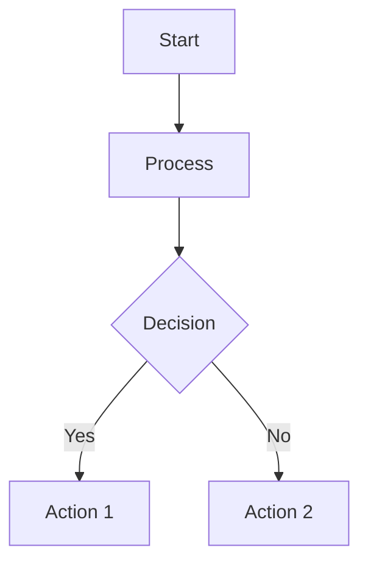
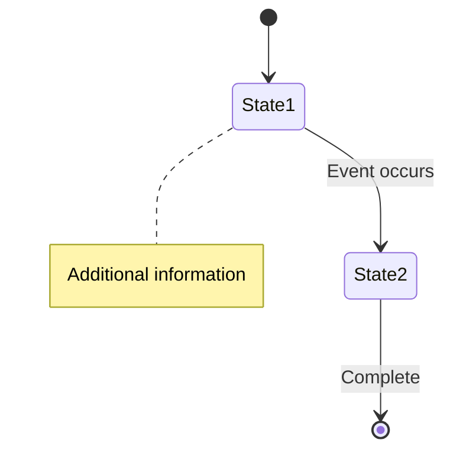
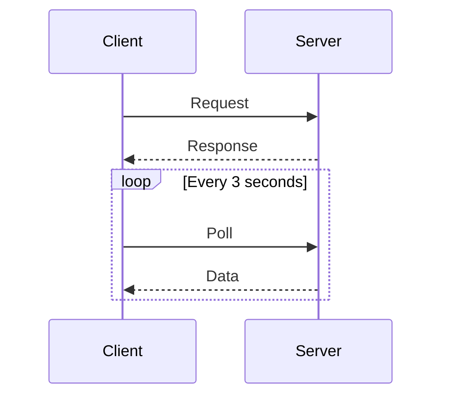
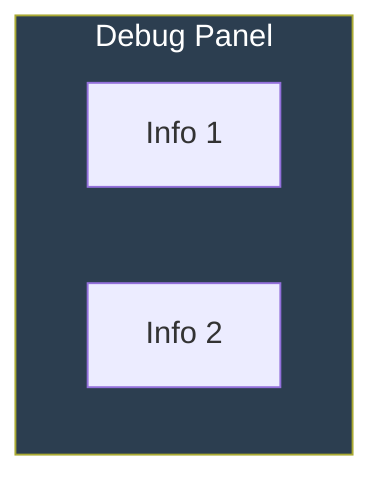
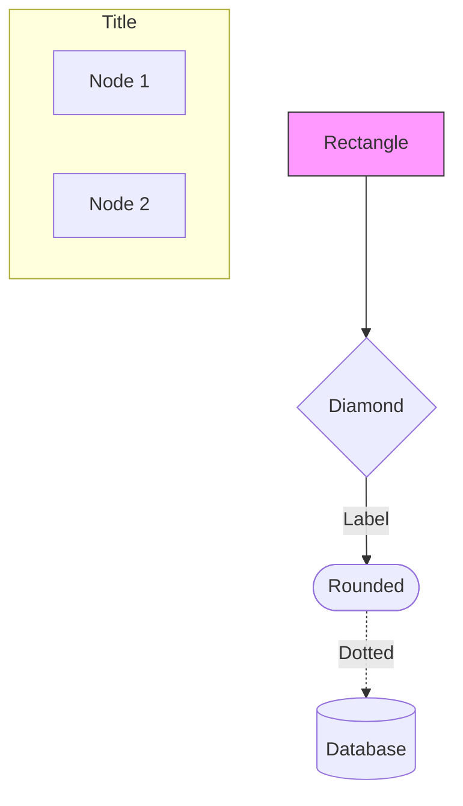
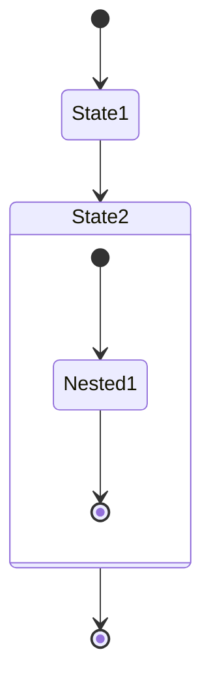
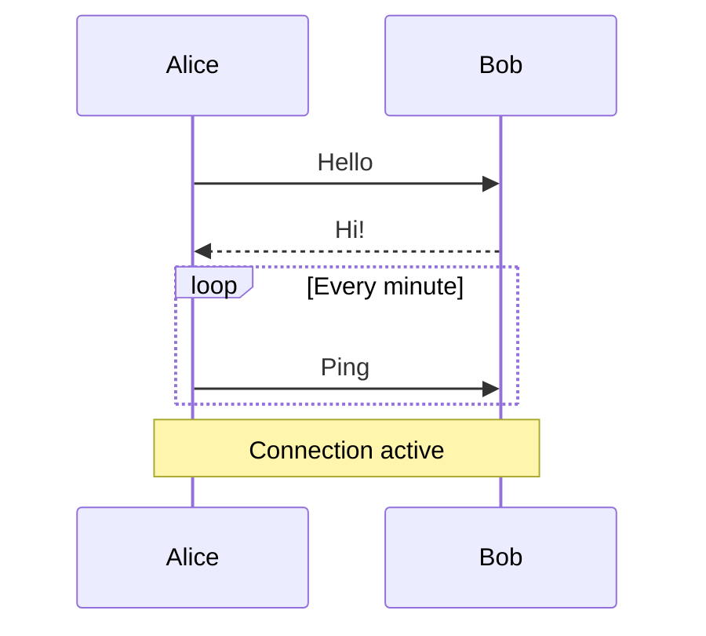
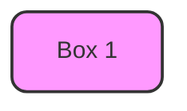

# SSE System - Mermaid Diagrams Reference

This document provides a quick reference to all Mermaid diagrams used in the SSE system documentation.

---

## 📊 Diagram Types Used

### 1. **Flowchart Diagrams** (`flowchart TB/TD`)
Used for: System architecture, data flows, component relationships

**Files:**
- `SSE_SYSTEM_ANALYSIS.md` - High-Level Flow
- `SSE_COMPARISON_CHART.md` - Message Reception Flow
- `SSE_COMPARISON_CHART.md` - Monitoring Data Flow
- `SSE_COMPARISON_CHART.md` - Client/Admin Architecture

**Features:**
- Subgraphs for grouping related components
- Color-coded nodes for visual clarity
- Directional flows with labeled edges
- Dotted lines for network connections

**Example:**


---

### 2. **State Diagrams** (`stateDiagram-v2`)
Used for: Connection lifecycles, session management, state transitions

**Files:**
- `SSE_COMPARISON_CHART.md` - Normal User Connection Lifecycle
- `SSE_COMPARISON_CHART.md` - Admin Monitoring Session

**Features:**
- Clear state transitions
- Notes for additional context
- Nested states for complex processes
- Start/end markers

**Example:**


---

### 3. **Sequence Diagrams** (`sequenceDiagram`)
Used for: Message flows, interaction patterns, API calls

**Files:**
- `SSE_COMPARISON_CHART.md` - Normal User Typical Flow
- `SSE_COMPARISON_CHART.md` - Admin Typical Flow

**Features:**
- Multiple participants (actors)
- Time-based interaction flow
- Loop constructs for repeated actions
- Notes for timing information
- Activation boxes for processing

**Example:**


---

### 4. **Graph Diagrams** (`graph TD/TB`)
Used for: UI mockups, component layouts

**Files:**
- `SSE_COMPARISON_CHART.md` - Debug Panel UI
- `SSE_COMPARISON_CHART.md` - Admin Dashboard UI

**Features:**
- Simple node relationships
- Custom styling for visual appeal
- Subgraphs for panels/sections

**Example:**


---

## 🎨 Color Scheme

### System Architecture Colors
- **Client Side:** `#e1f5ff` (Light Blue)
- **Server Side:** `#fff4e1` (Light Orange)
- **Key Components:** `#d4edda` (Light Green)
- **Storage:** `#f8d7da` (Light Red)

### Flow Diagram Colors (Rainbow)
- **Step 1:** `#ff6b6b` (Red)
- **Step 2:** `#ffd93d` (Yellow)
- **Step 3:** `#6bcf7f` (Green)
- **Step 4:** `#4d96ff` (Blue)
- **Step 5:** `#9b59b6` (Purple)
- **Step 6:** `#e67e22` (Orange)
- **Step 7:** `#1abc9c` (Teal)
- **Step 8:** `#3498db` (Sky Blue)
- **Step 9:** `#2ecc71` (Light Green)
- **Step 10:** `#f39c12` (Dark Orange)

### Status Colors
- **Success/Connected:** `#27ae60`, `#28a745` (Green)
- **Active/Info:** `#3498db`, `#007bff` (Blue)
- **Warning/Poor:** `#ffc107`, `#fd7e14` (Yellow/Orange)
- **Error/Critical:** `#dc3545`, `#ff6b6b` (Red)
- **Disabled/Inactive:** `#95a5a6` (Gray)

---

## 📁 File Structure

### SSE_SYSTEM_ANALYSIS.md
Contains: **1 Mermaid diagram**
- High-Level System Architecture (flowchart)

### SSE_COMPARISON_CHART.md
Contains: **9 Mermaid diagrams**
1. Normal User - Message Reception Flow (flowchart)
2. Admin - Monitoring Data Flow (flowchart)
3. Normal User - Debug Panel UI (graph)
4. Admin - Full Dashboard UI (graph)
5. Normal User - Client Architecture (flowchart)
6. Admin - Monitoring Architecture (flowchart)
7. Normal User - Connection Lifecycle (stateDiagram)
8. Admin - Monitoring Session (stateDiagram)
9. Normal User - Typical Flow (sequenceDiagram)
10. Admin - Typical Flow (sequenceDiagram)

**Total:** 10 Mermaid diagrams across both files

---

## 🔧 Rendering the Diagrams

### In GitHub/GitLab
Mermaid diagrams render automatically in:
- README files
- Wiki pages
- Issue/PR descriptions
- Any `.md` file in the repository

### In VS Code
Install the **Mermaid Preview** extension:
```bash
ext install vstirbu.vscode-mermaid-preview
```

### In Documentation Sites
Most static site generators support Mermaid:
- **Docusaurus:** Built-in support
- **VitePress:** Built-in support
- **MkDocs:** Via plugin (`mkdocs-mermaid2-plugin`)
- **Jekyll:** Via plugin (`jekyll-mermaid`)

### Online Editors
- [Mermaid Live Editor](https://mermaid.live)
- [Mermaid Chart](https://www.mermaidchart.com)

---

## 📖 Mermaid Syntax Quick Reference

### Flowchart


### State Diagram


### Sequence Diagram


---

## 🎯 Best Practices

### 1. **Use Descriptive Labels**
```mermaid
A["Global SSE Manager<br/>(Singleton)"]
```
Instead of:
```mermaid
A[Manager]
```

### 2. **Group Related Components**
```mermaid
subgraph CLIENT["CLIENT SIDE"]
    A[Component 1]
    B[Component 2]
end
```

### 3. **Use Consistent Colors**
- Keep color schemes consistent across diagrams
- Use semantic colors (green=success, red=error)

### 4. **Add Context with Notes**
```mermaid
note right of State
    Additional information
    or explanation
end note
```

### 5. **Keep It Simple**
- Don't overcrowd diagrams
- Split complex flows into multiple diagrams
- Use clear, readable labels

---

## 🔍 Diagram Purposes

| Diagram | Purpose | Best For |
|---------|---------|----------|
| **Flowchart** | Show process flow, architecture | System design, data flow |
| **State Diagram** | Show state changes over time | Connection lifecycle, sessions |
| **Sequence Diagram** | Show interactions between components | API calls, message passing |
| **Graph** | Show relationships, layouts | UI mockups, simple structures |
| **Class Diagram** | Show data structures | Database schema, types |
| **ER Diagram** | Show entity relationships | Database design |
| **Gantt Chart** | Show timeline/schedule | Project planning |
| **Pie/Bar Chart** | Show statistics | Metrics, analytics |

---

## 📚 Additional Resources

### Official Documentation
- [Mermaid Official Docs](https://mermaid.js.org/)
- [Mermaid Syntax Guide](https://mermaid.js.org/intro/syntax-reference.html)
- [Mermaid Flowchart Docs](https://mermaid.js.org/syntax/flowchart.html)

### Tutorials
- [Mermaid Tutorial on GitHub](https://github.blog/2022-02-14-include-diagrams-markdown-files-mermaid/)
- [Mermaid Cheat Sheet](https://jojozhuang.github.io/tutorial/mermaid-cheat-sheet/)

### Tools
- [Mermaid Live Editor](https://mermaid.live)
- [VS Code Extension](https://marketplace.visualstudio.com/items?itemName=vstirbu.vscode-mermaid-preview)
- [Chrome Extension](https://chrome.google.com/webstore/detail/mermaid-diagrams/phfcghedmopjadpojhmmaffjmfiakfil)

---

## 🎨 Custom Styling Examples

### Gradient Background


### Rounded Corners


### Conditional Styling


---

**End of Reference**

