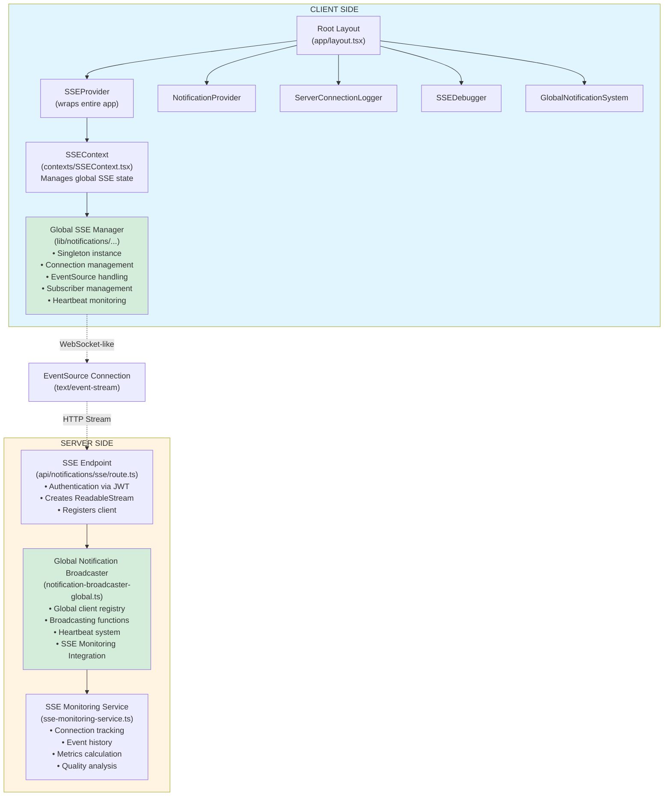

# SSE System - Comprehensive Analysis
**Date:** October 16, 2025  
**Analysis Type:** Full System Architecture Review

---

## Executive Summary

Your application implements a **Global Server-Sent Events (SSE) system** for real-time bidirectional communication between the server and connected clients. The system uses a **single-connection-per-user architecture** with sophisticated monitoring capabilities for administrators.

### Key Statistics
- **Architecture:** Singleton pattern with global state management
- **Connection Type:** Unidirectional SSE (server → client)
- **Message Format:** JSON over text/event-stream
- **Heartbeat Interval:** 30 seconds
- **Reconnection:** Exponential backoff (max 5 attempts)
- **Admin Monitoring:** Real-time connection tracking and metrics

---

## 🎯 System Architecture

### High-Level Flow



---

## 📱 Normal User Side - Detailed Analysis

### 1. Connection Initialization

#### Entry Point: `app/layout.tsx`
```tsx
<SSEProvider>
  <NotificationProvider>
    <ServerConnectionLogger />
    <SSEDebugger />
    <GlobalNotificationSystem />
    {children}
  </NotificationProvider>
</SSEProvider>
```

**Key Points:**
- SSE is initialized at the **root layout level**
- Connection persists across **all page navigations**
- Single connection shared by all components
- Automatically connects when user is authenticated

### 2. Client-Side Components

#### A. SSEProvider (`contexts/SSEContext.tsx`)
**Responsibilities:**
- Manages global SSE connection state
- Subscribes to global SSE manager
- Tracks connection quality
- Monitors retry attempts
- Provides context to all components

**State Management:**
```typescript
interface SSEContextType {
  connected: boolean;           // Is currently connected
  connecting: boolean;          // Is attempting to connect
  error: string | null;         // Current error message
  lastMessage: SSEMessage | null; // Most recent message
  connectionQuality: "excellent" | "good" | "poor" | "disconnected";
  retryCount: number;           // Number of reconnection attempts
  subscribers: number;          // Number of active subscribers
}
```

**Connection Quality Logic:**
- **Excellent:** < 30 seconds since last message
- **Good:** 30-60 seconds since last message
- **Poor:** > 60 seconds since last message
- **Disconnected:** No active connection

#### B. Global SSE Manager (`lib/notifications/global-sse-manager.ts`)
**Singleton Pattern:**
```typescript
class GlobalSSEManager {
  private static instance: GlobalSSEManager;
  private eventSource: EventSource | null = null;
  private subscribers: Map<string, SSESubscriber> = new Map();
  // ...
}
```

**Key Features:**

1. **Single Connection Management:**
   - Only one EventSource instance per user
   - Connection shared across all subscribers
   - Automatic cleanup when no subscribers remain

2. **User Management:**
   - `setUser(user)`: Associates connection with user
   - `clearUser()`: Disconnects and clears user data
   - Connection only established when both user exists AND subscribers > 0

3. **Subscription System:**
```typescript
subscribe(subscriberId: string, callback: (message: SSEMessage) => void)
// Returns: unsubscribe function
```
   - Multiple components can subscribe to same connection
   - Each subscriber gets a copy of every message
   - Automatic unsubscribe on component unmount

4. **Reconnection Logic:**
   - Exponential backoff: `delay = 1000 * 2^(attempt-1)`
   - Maximum 5 reconnection attempts
   - Resets on successful connection
   - Example: 1s → 2s → 4s → 8s → 16s

5. **Heartbeat Monitoring:**
   - Checks every 30 seconds
   - Reconnects if no message received in 60 seconds
   - Prevents stale connections

### 3. Notification Flow

#### A. Message Reception
```typescript
eventSource.onmessage = (event) => {
  const data = JSON.parse(event.data);
  // Broadcast to all subscribers
  this.subscribers.forEach(subscriber => {
    subscriber.callback(data);
  });
}
```

#### B. Notification Types
```typescript
type MessageType = 
  | "connection"              // Initial connection
  | "heartbeat"              // Keep-alive (30s interval)
  | "transfer_status_change" // Transfer status updated
  | "new_transfer"           // New transfer created
  | "urgent_transfer"        // Urgent transfer alert
  | "transfer_reminder";     // Scheduled reminder
```

#### C. Component Integration Example
```typescript
const { lastMessage } = useSSE();

useEffect(() => {
  if (!lastMessage) return;
  
  switch (lastMessage.type) {
    case 'transfer_status_change':
      // Update UI with new status
      break;
    case 'urgent_transfer':
      // Show urgent alert
      // Play sound notification
      break;
  }
}, [lastMessage]);
```

### 4. Notification Manager (`components/features/notifications/NotificationManager.tsx`)

**Features:**

1. **Toast Notifications:**
   - Max 3-5 toasts displayed simultaneously
   - Auto-hide after 5-7 seconds (configurable)
   - Visual animations with Framer Motion
   - Priority-based styling

2. **Sound System:**
   - Uses Web Audio API (not audio files)
   - Generates 800Hz beep (200ms duration)
   - Automatic permission handling
   - Volume control (30% default)

3. **Notification Processing:**
```typescript
// Receives SSE message
lastMessage → 
  // Converts to notification
  handleNotification() → 
    // Displays toast
    addToastNotification() → 
      // Plays sound
      playSound()
```

### 5. User-Facing Debug Tools

#### SSEDebugger Component
**Location:** Bottom-right corner (fixed position)  
**Information Displayed:**
- Connection status (Yes/No)
- Connecting state
- Connection quality
- Number of subscribers
- Retry count
- Current error (if any)
- Last message details

**Purpose:** Allows users/developers to monitor SSE connection health in real-time

---

## 👨‍💼 Admin Side - Detailed Analysis

### 1. Admin Monitoring Dashboard

#### Location: `/admin/monitoring/sse`

**Features:**

1. **Real-Time Metrics Dashboard:**
   - Total connections count
   - Active connections count
   - Total events today
   - Average connection duration
   - Auto-refresh every 3 seconds

2. **Connection Quality Distribution:**
   - Excellent: Long-lived, recent activity, no reconnections
   - Good: Stable with minimal issues
   - Poor: Some connectivity issues
   - Critical: Multiple problems

3. **Active Connections List:**
   - User email
   - Connection duration
   - Event count
   - Last ping time
   - Quality indicator
   - Reconnection attempts

4. **Recent Events Feed:**
   - Real-time event stream
   - Event types: connect, disconnect, heartbeat, error
   - Timestamp for each event
   - User identification
   - Event details

### 2. Server-Side Monitoring

#### A. Notification Broadcaster (`lib/notifications/notification-broadcaster-global.ts`)

**Global State Management:**
```typescript
let clients: Map<string, SSEClient> = new Map();
let heartbeatInterval: NodeJS.Timeout | null = null;
```

**SSEClient Structure:**
```typescript
interface SSEClient {
  userId: string;
  userType: string;
  controller: ReadableStreamDefaultController;
  lastActivity: number;
}
```

**Key Functions:**

1. **registerClient(userId, userType, controller):**
   - Adds client to global registry
   - Sends initial connection message
   - Tracks connection in monitoring system
   - Starts heartbeat if first client

2. **unregisterClient(userId):**
   - Removes from registry
   - Tracks disconnection event
   - Cleans up resources

3. **Broadcasting Functions:**
```typescript
// Target specific user
broadcastToUser(userId, notification): boolean

// Target all users
broadcastToAll(notification): number

// Target by role (manager, employee, admin)
broadcastToUserType(userType, notification): number

// Get statistics
getStats(): { totalConnections, connectionsByType, clientIds }
```

4. **Heartbeat System:**
   - Interval: 30 seconds
   - Sends heartbeat to all clients
   - Cleans up stale connections (>1 minute inactive)
   - Tracks heartbeat events in monitoring

#### B. SSE Monitoring Service (`lib/notifications/sse-monitoring-service.ts`)

**Tracked Metrics:**

1. **Connection Metrics:**
   - Total connections
   - Active connections
   - Disconnected connections
   - Reconnecting connections
   - Average connection duration
   - Total events today
   - Events per minute

2. **Connection Events:**
```typescript
interface ConnectionEvent {
  id: string;
  type: 'connect' | 'disconnect' | 'reconnect' | 'error' | 'ping' | 'heartbeat';
  userId: string;
  userEmail: string;
  userType: string;
  timestamp: Date;
  details: string;
  connectionId: string;
  ipAddress?: string;
}
```

3. **Connection Quality Calculation:**
```typescript
calculateConnectionQuality(connection):
  // Excellent: >5 min uptime, <1 min since ping, 0 reconnects
  // Good: >2 min uptime, <2 min since ping, ≤1 reconnect
  // Poor: <5 min since ping, ≤3 reconnects
  // Critical: Everything else
```

**Storage:**
- In-memory storage (not persisted)
- Last 1000 events kept
- Automatic cleanup of stale data
- Daily event count reset

#### C. SSE Monitoring Integration (`lib/notifications/sse-monitoring-integration.ts`)

**Purpose:** Bridge between broadcaster and monitoring service to avoid circular dependencies

**Tracked Data:**
```typescript
let activeConnections: Map<string, any> = new Map();
let connectionEvents: any[] = [];
let dailyEventCount: number = 0;
```

**Functions:**
- `trackConnectionEvent()`: Records connection events
- `updateConnectionStatus()`: Updates connection state
- `incrementConnectionEvents()`: Counts events per connection
- `getActiveConnections()`: Returns all active connections
- `cleanupStaleConnections()`: Removes dead connections

### 3. Admin API Endpoints

#### A. GET `/api/admin/monitoring/sse`
**Purpose:** Fetch real-time SSE monitoring data

**Response:**
```json
{
  "success": true,
  "data": {
    "connections": [...],
    "metrics": {
      "totalConnections": 15,
      "activeConnections": 12,
      "disconnectedConnections": 2,
      "reconnectingConnections": 1,
      "averageConnectionDuration": 45,
      "totalEventsToday": 1245,
      "eventsPerMinute": 15,
      "connectionQuality": {
        "excellent": 8,
        "good": 3,
        "poor": 1,
        "critical": 0
      }
    },
    "recentEvents": [...]
  }
}
```

**Authentication:** Requires super_admin role

**Update Frequency:** Dashboard polls every 3 seconds

#### B. POST `/api/admin/monitoring/test-sse`
**Purpose:** Test SSE monitoring integration

**Actions:**
- `connect`: Simulate connection
- `disconnect`: Simulate disconnection
- `heartbeat`: Simulate heartbeat

**Response:**
```json
{
  "success": true,
  "message": "Test connect completed",
  "data": {
    "activeConnections": 5,
    "recentEvents": 10,
    "dailyEvents": 150,
    "connections": [...],
    "events": [...]
  }
}
```

#### C. GET `/api/admin/monitoring/clear-sse`
**Purpose:** Clear all SSE monitoring data (development only)

---

## 🔐 Security & Authentication

### 1. Connection Authentication

**Endpoint:** `GET /api/notifications/sse`

**Authentication Flow:**
```typescript
// 1. Extract JWT from cookies
const authResult = await requireEmployeeOrManager(request);

// 2. Verify token
if (!authResult.success) {
  return authResult.response; // 401 Unauthorized
}

// 3. Create authenticated SSE stream
const userId = authResult.user._id;
const userType = authResult.user.userType;
```

**User Types Allowed:**
- `employee`: Regular staff members
- `manager`: Department managers
- `admin`: System administrators
- `super_admin`: Full system access

### 2. Middleware Protection

**File:** `middleware.ts`

**Admin Route Protection:**
```typescript
if (isAdminRoute) {
  const isAdmin = payload.userType === 'admin' || 
                  payload.userType === 'super_admin';
  if (!isAdmin) {
    return NextResponse.redirect('/dashboard');
  }
}
```

**API Route Headers:**
```typescript
requestHeaders.set('x-user-id', payload.userId);
requestHeaders.set('x-user-type', payload.userType);
requestHeaders.set('x-user-email', payload.email);
```

### 3. Connection Security

**SSE Response Headers:**
```typescript
{
  'Content-Type': 'text/event-stream',
  'Cache-Control': 'no-cache',
  'Connection': 'keep-alive',
  'Access-Control-Allow-Origin': '*',
  'Access-Control-Allow-Headers': 'Cache-Control'
}
```

**Security Measures:**
- JWT-based authentication
- Cookie-based token storage
- Automatic connection cleanup
- Stale connection detection
- Client disconnection handling

---

## 📊 Message Flow & Broadcasting

### 1. Server → Client Message Format

```typescript
// SSE message format
data: {
  "type": "transfer_status_change",
  "priority": "high",
  "title": "Transfer Status Updated",
  "message": "Transfer for John Doe status changed...",
  "transferId": "TRF-2025-001",
  "transfer": {...},
  "changedBy": {...},
  "timestamp": "2025-10-16T10:30:00Z",
  "read": false
}
```

### 2. Broadcasting Scenarios

#### Scenario 1: Transfer Status Change
```typescript
// Transfer status changes
transfer.status = 'accepted'

// Notification created
const notification = {
  type: 'transfer_status_change',
  // ... details
};

// Broadcast to relevant users
broadcastToUser(requestedBy.userId, notification);
broadcastToUser(assignedTo.userId, notification);
broadcastToUserType('manager', notification);
```

#### Scenario 2: Urgent Transfer
```typescript
// Urgent/stat transfer created
if (transfer.priority === 'stat') {
  const urgentNotification = {
    type: 'urgent_transfer',
    priority: 'high',
    // ... details
  };
  
  // Broadcast to all relevant users
  broadcastToUserType('manager', urgentNotification);
  broadcastToUserType('employee', urgentNotification);
}
```

#### Scenario 3: Heartbeat
```typescript
// Every 30 seconds
setInterval(() => {
  for (const [userId, client] of clients.entries()) {
    sendToClient(userId, {
      type: 'heartbeat',
      timestamp: new Date().toISOString()
    });
  }
}, 30000);
```

---

## ⚠️ Current Issues & Limitations

### 1. Architecture Issues

#### ❌ **No Server-Side Message Persistence**
- Messages sent only to currently connected clients
- Offline users miss notifications
- No message queue or buffer

**Impact:** Users who disconnect miss critical updates

**Potential Solution:**
```typescript
// Store notifications in database
await Notification.create({
  userId,
  type,
  message,
  read: false,
  delivered: false
});

// On reconnection, send missed notifications
const missedNotifications = await Notification.find({
  userId,
  delivered: false
});
```

#### ❌ **In-Memory Storage Only**
- All monitoring data lost on server restart
- No historical analysis capability
- No long-term metrics

**Impact:** Cannot track trends or generate reports

**Potential Solution:** Store events in MongoDB or Redis

#### ❌ **Limited Scalability**
- Global Map for clients (single server only)
- Won't work in multi-server/cluster setup
- No load balancing support

**Impact:** Cannot scale horizontally

**Potential Solution:** Use Redis for distributed state management

### 2. Connection Management Issues

#### ⚠️ **Stale Connection Detection**
- Only checks every 30 seconds
- 1-minute threshold may be too long
- No active connection testing

**Current Logic:**
```typescript
// Only cleans up connections with no activity for 60 seconds
if (now - client.lastActivity > staleThreshold) {
  clients.delete(userId);
}
```

**Recommendation:** Implement ping/pong protocol

#### ⚠️ **Reconnection Limits**
- Hard limit of 5 reconnection attempts
- No manual reconnect after limit reached
- User may need to refresh page

**Current Logic:**
```typescript
if (this.reconnectAttempts < this.maxReconnectAttempts) {
  // Attempt reconnection
} else {
  console.error('Max reconnection attempts reached');
  // Connection permanently failed
}
```

**Recommendation:** Add manual reconnect button or longer-term retry

### 3. Browser Compatibility

#### ⚠️ **EventSource Limitations**
- No IE support (only modern browsers)
- No custom headers (auth via cookies only)
- No binary data support
- Unidirectional only

**Alternative Considered:** WebSockets
- Bidirectional communication
- Binary support
- Custom headers
- But more complex to implement

### 4. Monitoring Gaps

#### ⚠️ **No Bandwidth Tracking**
- Can't measure message sizes
- No network performance metrics
- No data transfer statistics

#### ⚠️ **No User Session Correlation**
- Can't track multiple tabs/windows per user
- Each tab = separate connection
- No way to identify duplicate sessions

#### ⚠️ **No Alerting System**
- Admins must actively monitor dashboard
- No automatic alerts for issues
- No notification on connection spikes/failures

---

## 💡 Strengths & Best Practices

### ✅ **Strengths**

1. **Single Connection Architecture:**
   - Efficient resource usage
   - No duplicate connections
   - Shared state across components
   - Persistent across navigation

2. **Automatic Reconnection:**
   - Exponential backoff
   - Transparent to user
   - Maintains connection integrity

3. **Comprehensive Monitoring:**
   - Real-time connection tracking
   - Event history
   - Quality metrics
   - Admin dashboard

4. **Proper Separation of Concerns:**
   - Context for state management
   - Singleton for connection
   - Separate monitoring service
   - Clean component integration

5. **User Experience:**
   - Toast notifications
   - Sound alerts
   - Debug information
   - Connection quality indicators

### ✅ **Best Practices Followed**

1. **Singleton Pattern:**
   ```typescript
   private static instance: GlobalSSEManager;
   public static getInstance(): GlobalSSEManager
   ```

2. **Cleanup on Unmount:**
   ```typescript
   return () => {
     unsubscribe();
     clearInterval(statusInterval);
   };
   ```

3. **Error Handling:**
   ```typescript
   try {
     // Connection logic
   } catch (error) {
     console.error('Connection failed:', error);
     // Attempt reconnection
   }
   ```

4. **TypeScript Interfaces:**
   - Strong typing for messages
   - Clear contracts
   - Type safety

---

## 🚀 Recommendations

### High Priority

1. **Implement Message Persistence:**
   ```typescript
   // Store in database
   interface StoredNotification {
     userId: string;
     message: SSEMessage;
     delivered: boolean;
     createdAt: Date;
   }
   
   // Send missed notifications on reconnect
   ```

2. **Add Redis for Distributed State:**
   ```typescript
   // Use Redis pub/sub for multi-server support
   const redis = new Redis();
   redis.subscribe('sse-notifications');
   ```

3. **Implement Proper Health Checks:**
   ```typescript
   // Server endpoint
   GET /api/health/sse
   
   // Response
   {
     status: 'healthy',
     activeConnections: 15,
     lastHeartbeat: '2025-10-16T10:30:00Z'
   }
   ```

### Medium Priority

4. **Add Connection Metrics Dashboard:**
   - Connection duration histogram
   - Event rate graph
   - Error rate tracking
   - User type distribution

5. **Implement Notification Preferences:**
   ```typescript
   interface NotificationPreferences {
     enableSound: boolean;
     enableToasts: boolean;
     notificationTypes: {
       transfer_status_change: boolean;
       urgent_transfer: boolean;
       // ...
     };
   }
   ```

6. **Add Manual Reconnect:**
   ```typescript
   // In UI
   <button onClick={forceReconnect}>
     Reconnect Manually
   </button>
   ```

### Low Priority

7. **Add Notification Queue UI:**
   - Show queued notifications
   - Retry failed deliveries
   - Clear old notifications

8. **Implement Rate Limiting:**
   ```typescript
   // Limit broadcasts per user
   const rateLimiter = new Map<string, number>();
   if (rateLimiter.get(userId) > MAX_RATE) {
     // Throttle
   }
   ```

---

## 📝 Technical Specifications

### Client-Side
- **Framework:** Next.js 15 (App Router)
- **Language:** TypeScript
- **State Management:** React Context API
- **Connection:** EventSource API
- **UI:** Tailwind CSS + Framer Motion

### Server-Side
- **Runtime:** Node.js
- **Framework:** Next.js API Routes
- **Authentication:** JWT (jsonwebtoken)
- **Database:** MongoDB (Mongoose)
- **Streaming:** ReadableStream API

### Message Protocol
- **Format:** JSON over SSE
- **Encoding:** UTF-8
- **Content-Type:** text/event-stream
- **Line Terminator:** \n\n

### Performance
- **Heartbeat:** 30 seconds
- **Stale Threshold:** 60 seconds
- **Max Reconnects:** 5 attempts
- **Backoff:** Exponential (1s → 32s)
- **Toast Auto-hide:** 5 seconds
- **Dashboard Refresh:** 3 seconds

---

## 🎯 Conclusion

Your SSE system is **well-architected** for a single-server deployment with good separation of concerns and comprehensive monitoring. The singleton pattern prevents connection duplication, and the automatic reconnection logic provides resilience.

### System Rating

| Aspect | Rating | Notes |
|--------|--------|-------|
| Architecture | ⭐⭐⭐⭐ | Clean, maintainable, but not horizontally scalable |
| User Experience | ⭐⭐⭐⭐⭐ | Excellent notifications and debugging tools |
| Admin Monitoring | ⭐⭐⭐⭐⭐ | Comprehensive real-time dashboard |
| Security | ⭐⭐⭐⭐ | Good JWT authentication, proper middleware |
| Scalability | ⭐⭐ | Limited to single server, needs Redis |
| Reliability | ⭐⭐⭐ | Good reconnection, but no message persistence |
| Performance | ⭐⭐⭐⭐ | Efficient single-connection design |

### Overall: ⭐⭐⭐⭐ (4/5)

The system works well for current scale but needs improvements for:
- Multi-server deployments
- Message persistence
- Long-term metric storage

---

**End of Analysis**

